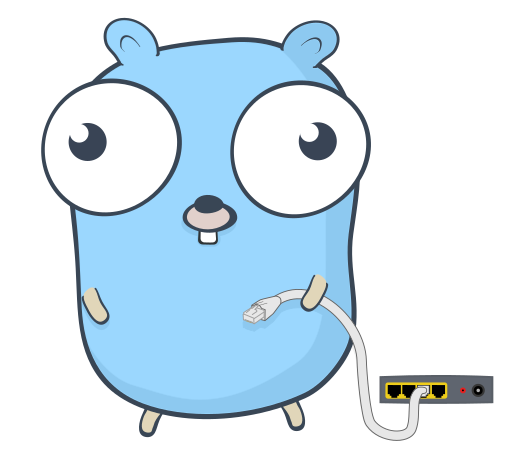

<p align="center">
<h1 style="border-bottom: none;">Devy</h1>



A developer focused discord bot written in go
</p>

## Run

Copy `.env.sample` to `.env` and add secrets

```sh
cp .env.sample .env
```

Install [godotenv](https://github.com/joho/godotenv)

```sh
go install github.com/joho/godotenv/cmd/godotenv@latest
```

Run the following command to run the application.

 ```sh
godotenv -f .env go run cmd/bot/main.go
 ```

## Stack

* Go v1.17
* Discord

## How to Contribute

* Fork the project
* Push changes
* Create a PR and add reveiwers

## How to Test on a Test Bot


## Ideas

* [ ] Forces you to change nick name to real name
* [ ] Displays github data
* [ ] Gives us newest fireship videos
* [ ] Scrapes for new changes to certain lang's
* [ ] Coding challenges and scoreboards
* [ ] Maybe something with leetcode
* [ ] New Job openings for those looking for a new job

## Known Issues

Error displaying in console
```sh
YYYY/MM/DD hh:mm:ss error closing resp body
```
https://github.com/bwmarrin/discordgo/issues/1028
https://github.com/golang/go/issues/49366
